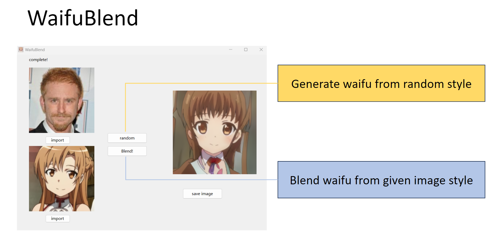

# WaifuBlend
a python exe generate stylized anime girl images

## What is it
Its a generative model's inference part based on [GNR](https://github.com/mchong6/GANsNRoses). It takes two images as input, one is photo-realistic human face and the other is anime girl face. 
Together it will generate an anime girl face based on the style code obtained from anime girl and content code obtained from human face. 

## How to use
It runs based on enviroment with pytorch, PySide6. You can run it as a program, or convert it into exe by using pyinstaller. And you need to put downloaded model in /model_dir/model.pt.
You can download GNR's official model, or you can use mine finetuned one. I also have a packed exe program which is easy to use.

## Download EXE 
[WaifuBlend](https://github.com/brohaooo/WaifuBlend/releases/tag/v1.0)

